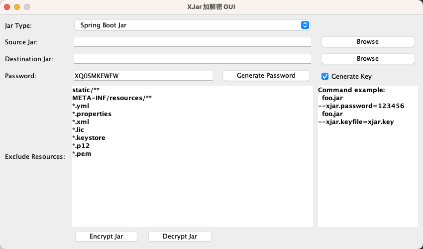

# xjar-gui

## 项目简介
`xjar-gui` 是一个为 [xjar](https://github.com/core-lib/xjar) 工具设计的图形用户界面 (GUI) 应用程序，旨在简化 Java JAR (Java Archive) 包的加密、保护或混淆操作。通过直观的用户界面，开发者和运维人员可以轻松地对 JAR 文件进行处理，而无需记忆复杂的命令行参数，从而提高工作效率和便捷性。



## 主要特性

- **直观的用户界面：** 提供简单易用的图形界面，替代复杂的命令行操作。
- **JAR 文件处理：** 支持对单个或多个 JAR 文件进行加密、保护或混淆。
- **参数配置：** 允许用户通过界面轻松配置 `xjar` 工具的各种参数，如加密算法、密钥管理、混淆级别等。
- **操作日志：** 提供详细的操作日志，方便用户查看处理过程和排查问题。
- **跨平台兼容：** 作为 Java 应用程序，理论上可在支持 Java 运行环境的多个操作系统上运行。
- **一键式操作：** 简化了 JAR 文件处理流程，实现一键式的加密/保护操作。

## 安装与运行

### 前提条件

- Java Development Kit (JDK) 8 或更高版本。
- 已安装 `xjar` 命令行工具（如果 `xjar-gui` 依赖其内部调用）。

### 获取 `xjar-gui`

1. **从 GitHub 克隆项目：**

    ```
    git clone https://github.com/easonwy/xjar-gui.git
    ```

2. **进入项目目录：**

    ```
    cd xjar-gui
    ```

### 构建项目

使用 Maven 或 Gradle（根据项目实际构建工具）进行构建。假设使用 Maven：

```
mvn clean install
```

这将会在 `target` 目录下生成可执行的 JAR 文件（例如 `xjar-gui-1.0.0.jar`）。

### 运行应用程序

```
java -jar target/xjar-gui-1.0.0.jar
```

运行后，`xjar-gui` 的主界面将会显示。

## 使用方法

1. **选择 JAR 文件：** 在界面上点击“选择文件”或“选择目录”按钮，选择您需要处理的 JAR 文件或包含 JAR 文件的目录。
2. **配置处理参数：** 根据您的需求，在界面上设置 `xjar` 相关的处理参数，例如：
    - 加密类型（如 AES, RSA）
    - 密钥路径或生成选项
    - 混淆策略
    - 输出目录
3. **执行操作：** 点击“开始处理”或类似按钮，`xjar-gui` 将调用 `xjar` 工具对选定的 JAR 文件进行处理。
4. **查看日志：** 处理过程中，您可以在界面下方的日志区域查看实时进度和任何错误信息。
5. **获取结果：** 处理完成后，加密/保护后的 JAR 文件将生成在您指定的输出目录。

## 许可证

本项目采用 [Apache License 2.0] 进行许可。详情请参阅项目根目录下的 `LICENSE` 文件。

## 联系方式

如果您有任何问题或建议，可以通过 GitHub Issues 与我们联系。
